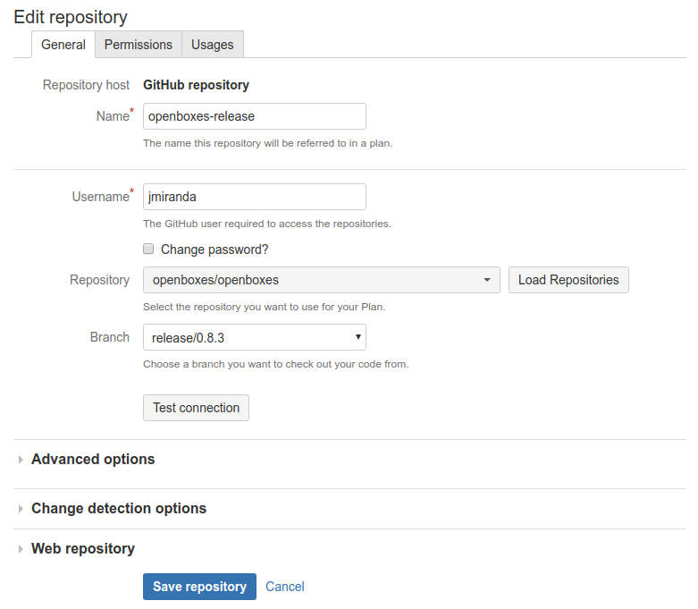

# Release Process

Created Thursday 21 March 2019

## Resources

* [https://www.atlassian.com/git/tutorials/comparing-workflows/gitflow-workflow](https://www.atlassian.com/git/tutorials/comparing-workflows/gitflow-workflow)
* [https://gitversion.readthedocs.io/en/latest/git-branching-strategies/gitflow-examples/](https://gitversion.readthedocs.io/en/latest/git-branching-strategies/gitflow-examples/)
* [https://gitversion.readthedocs.io/en/latest/git-branching-strategies/gitflow/](https://gitversion.readthedocs.io/en/latest/git-branching-strategies/gitflow/)
* [https://danielkummer.github.io/git-flow-cheatsheet/](https://danielkummer.github.io/git-flow-cheatsheet/)
* [https://medium.com/hard-work/gitflow-release-hotfix-bddee96fc5c3](https://medium.com/hard-work/gitflow-release-hotfix-bddee96fc5c3)
* [https://www.fredonism.com/a-practical-take-on-gitflow-and-semantic-versioning](https://www.fredonism.com/a-practical-take-on-gitflow-and-semantic-versioning)

## Overview

* Create JIRA version \(usually done while planning the release before development begins\)
* Create release branch
* Deploy to staging server \(OBNAVSTAGE\)
* QA Process
* Finalize Release

### Create JIRA version

This step usually occurs before development has begun on a new release as the version number `fixVersion` is usually attached to a ticket to let us know under what release that ticket should be included. However, if you haven't created a new JIRA version by the time you're ready to release here's one way to do it.


To create a version in JIRA:

1. Go to the OpenBoxes PIH project
2. Click on Releases
3. Click on Create Version
4. Enter version number, start date, end date, and comment
5. Click Save

You can also create a release from the Kanban board \(when releasing closed tickets\) or in the Agile \(Scrum\) board \(see Epics and Versions sidebar\).

### Create release branch

Once you have completed all of the tickets for the new version \(which could take several sprints\) and you have merged all pull requests \(PRs\) for these tickets, you're ready to create a release branch. This branch acts as a container for all changes that should be released for this version as well as any last minute bug fixes that need to be made before the release is finalized.

1. First of all, you'll need to checkout the develop branch and make sure you have all of the latest changes.

   ```text
    git checkout develop
    git pull --rebase
   ```

2. Create new release branch off develop

   ```text
    git checkout -b release/0.8.9
    git push --set-upstream origin release/0.8.9
   ```

3. Change version number in application.properties

   ```text
    app.version=0.8.9
   ```

4. Commit version change

   ```text
    git commit -am "bumped app version to 0.8.9"
   ```

### Change release branch on Bamboo

1. Go to Linked Repositories
2. Select openboxes-release
3. Change the Branch to release/0.8.9



Bamboo should automatically trigger a build for OBNAVSTAGE, but if that doesn't happen within a few minutes just go to the build plan page and trigger it manually. [http://bamboo.pih-emr.org:8085/browse/OPENBOXES-SDONS](http://bamboo.pih-emr.org:8085/browse/OPENBOXES-SDONS)

### Testing Release

Once the latest release branch has been deployed to OBNAVSTAGE we can start the QA pass. During this process we might add a few Bug tickets, but there should be no new features. Developers should either create branches off of release/0.8.9 or commit directly to the release branch.

### Finalize Release

Finalizing the release involves making the following changes to JIRA and Github.

Once the QA pass has been completed and there are no more bugs, we can start to finalize the release.

1. Close any tickets that have been completed
2. Move remaining tickets to the next sprint
3. Remove or change the fixVersion of any open tickets \(0.8.9 -&gt; 0.8.10\) 
4. Go to Agile board &gt; Active Sprints 
5. Close the current sprint using the current date as the End Date.
6. Go to Agile Board &gt; Complete Sprint
7. Go to Kanban Board &gt; Release 
8. Go to Versions page 
9. Merge 0.8.9-kanban1 into 0.8.9
10. Git &gt; Merge release/0.8.9 into master

    ```text
     git checkout master
     git merge release/0.8.9
     git push
    ```

11. Git &gt; Tag release/0.8.9 \([http://docs.openboxes.com/en/latest/developer-guide/tagging/](http://docs.openboxes.com/en/latest/developer-guide/tagging/)\)

    ```text
     git tag -a v0.8.9 -m 'Release 0.8.9' <commit-sha>
     git push --tags
    ```

12. Git &gt; Merge master into develop

    ```text
     git checkout develop
     git merge master
     # fix conflicts
     git push
    ```

13. Git &gt; Bump version

    ```text
     # bump version number in application.properties
     git add application.properties
     git commit -m "bumped app version to 0.8.10-SNAPSHOT"
     git push
    ```

14. Git &gt; Delete release/0.8.9 branch

    ```text
     git branch -d release/0.8.9
    ```

15. Github &gt; Create new release with release notes
16. Bamboo &gt; Download latest WAR from Daily Stable Build \(master\)
17. GitHub &gt; Upload WAR to release 
18. Publish Release Notes to openboxes.com
19. Bamboo &gt; Change openboxes-release back to master 

